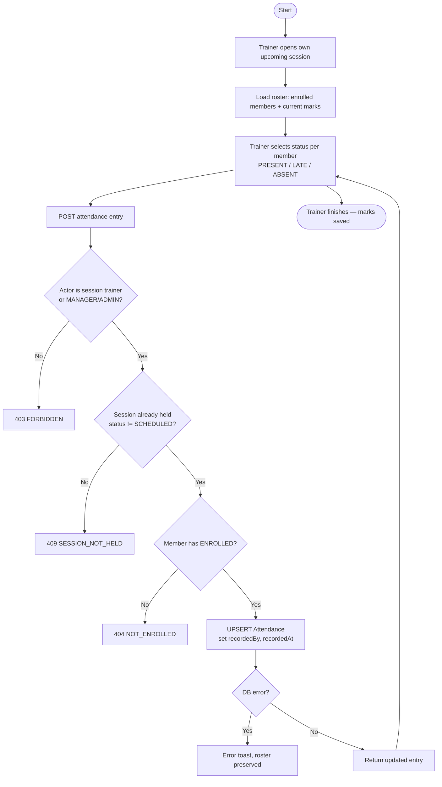

# Activity — Attendance Recording

```mermaid
flowchart TD
    A([Start]) --> B[Trainer opens own upcoming session]
    B --> C[Load roster: enrolled members + current marks]
    C --> D[Trainer selects status per member<br/>PRESENT / LATE / ABSENT]
    D --> E[POST attendance entry]
    E --> F{Actor is session trainer<br/>or MANAGER/ADMIN?}
    F -- No --> G[403 FORBIDDEN]
    F -- Yes --> H{Session already held<br/>status != SCHEDULED?}
    H -- No --> I[409 SESSION_NOT_HELD]
    H -- Yes --> J{Member has ENROLLED?}
    J -- No --> K[404 NOT_ENROLLED]
    J -- Yes --> L[UPSERT Attendance<br/>set recordedBy, recordedAt]
    L --> M{DB error?}
    M -- Yes --> N[Error toast, roster preserved]
    M -- No --> O[Return updated entry]
    O --> D
    D --> P([Trainer finishes — marks saved])
```

**Notes**: the loop continues until the trainer leaves the page; every mark is a separate validated upsert (rule R4, unique `(member, session)` in Stage 2).
