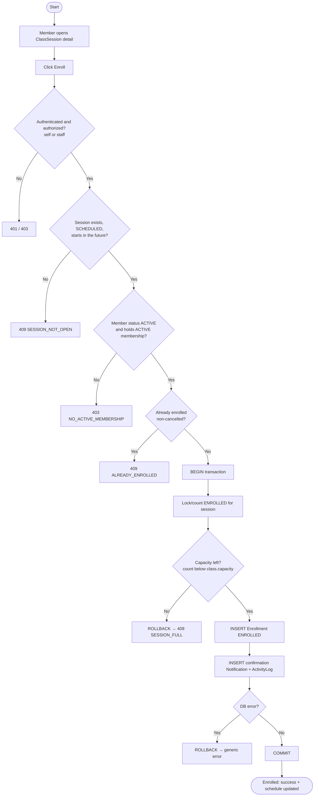

# Activity — Class Enrollment

```mermaid
flowchart TD
    A([Start]) --> B[Member opens ClassSession detail]
    B --> C[Click Enroll]
    C --> D{Authenticated and authorized?<br/>self or staff}
    D -- No --> E[401 / 403]
    D -- Yes --> F{Session exists, SCHEDULED,<br/>starts in the future?}
    F -- No --> G[409 SESSION_NOT_OPEN]
    F -- Yes --> H{Member status ACTIVE<br/>and holds ACTIVE membership?}
    H -- No --> I[403 NO_ACTIVE_MEMBERSHIP]
    H -- Yes --> J{Already enrolled<br/>non-cancelled?}
    J -- Yes --> K[409 ALREADY_ENROLLED]
    J -- No --> L[BEGIN transaction]
    L --> M[Lock/count ENROLLED for session]
    M --> N{Capacity left?<br/>count below class.capacity}
    N -- No --> O[ROLLBACK → 409 SESSION_FULL]
    N -- Yes --> P[INSERT Enrollment ENROLLED]
    P --> Q[INSERT confirmation Notification + ActivityLog]
    Q --> R{DB error?}
    R -- Yes --> S[ROLLBACK → generic error]
    R -- No --> T[COMMIT]
    T --> U([Enrolled: success + schedule updated])
```
