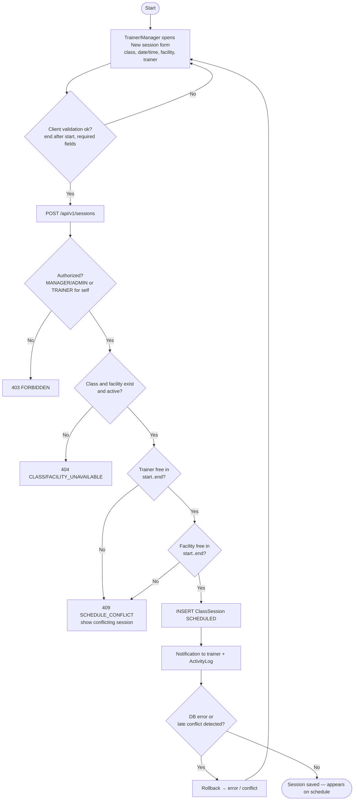

# Activity — Class Session Scheduling

```mermaid
flowchart TD
    A([Start]) --> B[Trainer/Manager opens New session form<br/>class, date/time, facility, trainer]
    B --> C{Client validation ok?<br/>end after start, required fields}
    C -- No --> B
    C -- Yes --> D[POST /api/v1/sessions]
    D --> E{Authorized?<br/>MANAGER/ADMIN or TRAINER for self}
    E -- No --> F[403 FORBIDDEN]
    E -- Yes --> G{Class and facility exist<br/>and active?}
    G -- No --> H[404 CLASS/FACILITY_UNAVAILABLE]
    G -- Yes --> I{Trainer free in<br/>start..end?}
    I -- No --> J[409 SCHEDULE_CONFLICT<br/>show conflicting session]
    I -- Yes --> K{Facility free in<br/>start..end?}
    K -- No --> J
    K -- Yes --> L[INSERT ClassSession SCHEDULED]
    L --> M[Notification to trainer + ActivityLog]
    M --> N{DB error or<br/>late conflict detected?}
    N -- Yes --> O[Rollback → error / conflict]
    O --> B
    N -- No --> P([Session saved — appears on schedule])
```
