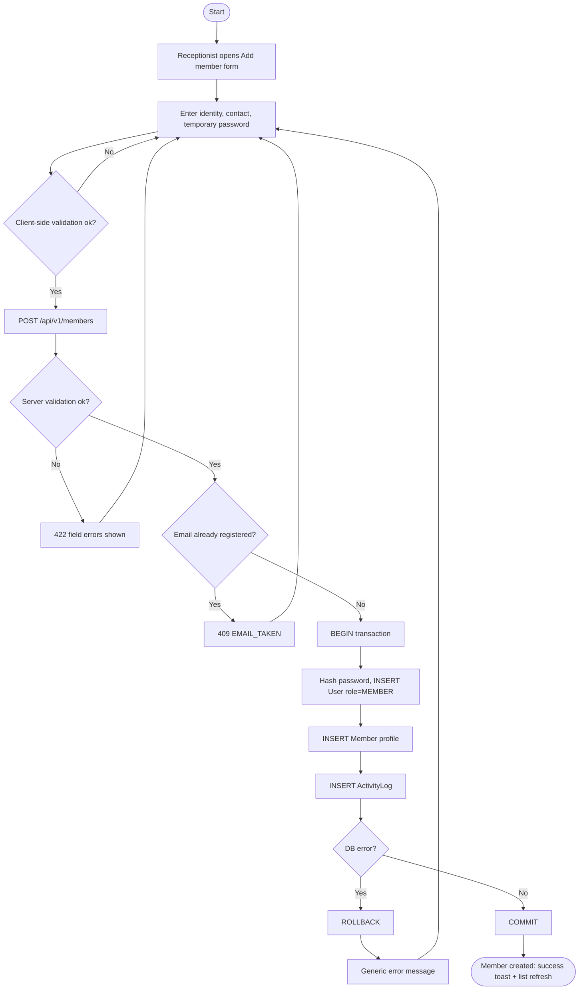

# Activity — Member Registration

```mermaid
flowchart TD
    A([Start]) --> B[Receptionist opens Add member form]
    B --> C[Enter identity, contact, temporary password]
    C --> D{Client-side validation ok?}
    D -- No --> C
    D -- Yes --> E[POST /api/v1/members]
    E --> F{Server validation ok?}
    F -- No --> G[422 field errors shown]
    G --> C
    F -- Yes --> H{Email already registered?}
    H -- Yes --> I[409 EMAIL_TAKEN]
    I --> C
    H -- No --> J[BEGIN transaction]
    J --> K[Hash password, INSERT User role=MEMBER]
    K --> L[INSERT Member profile]
    L --> M[INSERT ActivityLog]
    M --> N{DB error?}
    N -- Yes --> O[ROLLBACK]
    O --> P[Generic error message]
    P --> C
    N -- No --> Q[COMMIT]
    Q --> R([Member created: success toast + list refresh])
```
