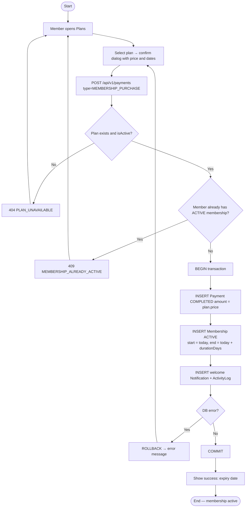

# Activity — Membership Purchase / Activation

**Notes**: price is taken server-side from the plan (rule R6); rollback guarantees "no membership without a completed payment" (rule R1). Later the same diagram covers expiry: a scheduled job marks `endDate < today` as `EXPIRED` (rule R2).
