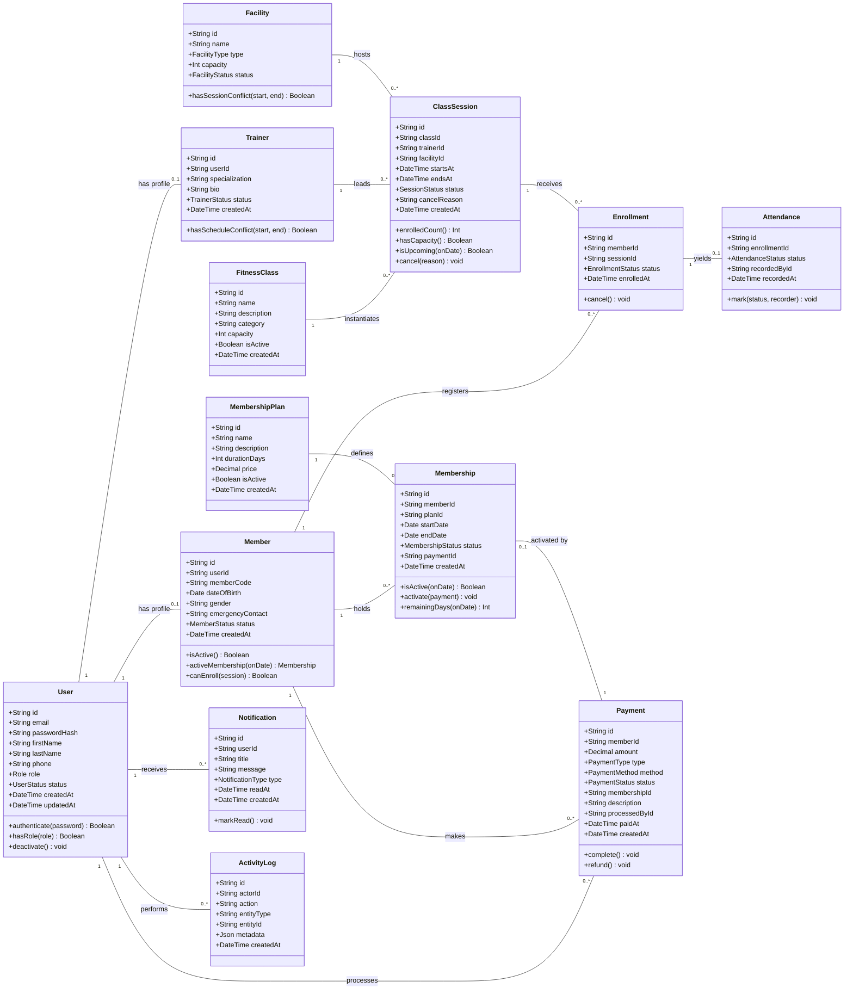

# Stage 1 — Class Diagram

## Notes

- **Composition over inheritance for identity**: `Member` and `Trainer` are profile entities composed with a `User` account rather than subclasses of `User`. A staff account (`ADMIN`/`MANAGER`/`RECEPTIONIST`) has no `Member`/`Trainer` profile; a `MEMBER` user always has exactly one `Member`, a `TRAINER` user exactly one `Trainer` (`userId` unique in both).
- **Cardinalities**: one active `Membership` per member (rule R1); `Attendance` exists only through an `Enrollment` (1:0..1); a `Payment` optionally activates a `Membership` (class fees have none).
- **Denormalization**: none in the model; `ClassSession.enrolledCount()` is computed, not stored — capacity is enforced inside a transaction at enrollment time (Stage 2/7).
- **Enums**: `Role = ADMIN | MANAGER | TRAINER | RECEPTIONIST | MEMBER`; `MembershipStatus = ACTIVE | EXPIRED | CANCELLED`; `SessionStatus = SCHEDULED | CANCELLED | COMPLETED`; `EnrollmentStatus = ENROLLED | CANCELLED`; `AttendanceStatus = PRESENT | ABSENT | LATE`; `PaymentStatus = PENDING | COMPLETED | FAILED | REFUNDED`; `PaymentMethod = CASH | CARD | BANK_TRANSFER`; `PaymentType = MEMBERSHIP_PURCHASE | CLASS_FEE | OTHER`; `FacilityType = GYM_FLOOR | STUDIO | POOL | COURT`; `NotificationType = INFO | WARNING | REMINDER`.
