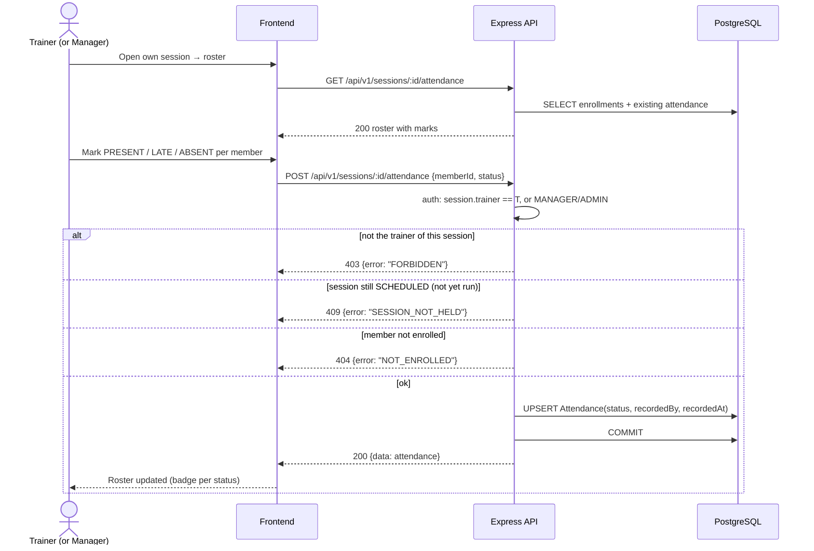

# Sequence — Attendance Registration

**Notes**: upsert keeps rule R4 (one attendance row per member per session, unique constraint in Stage 2); trainers only ever see rosters of their own sessions (R8).
