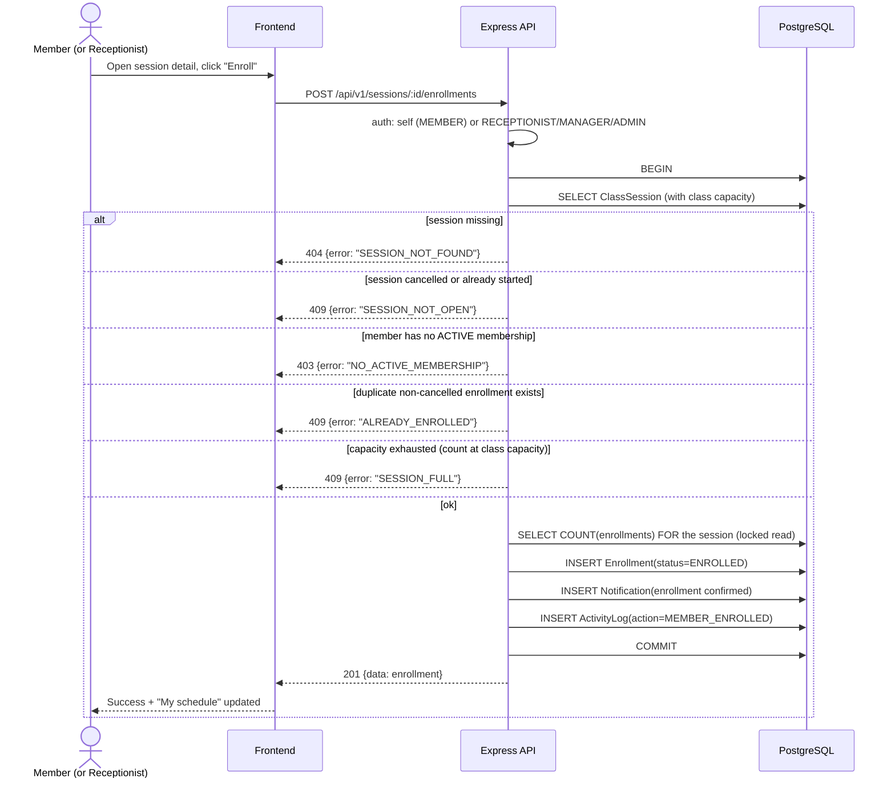

# Sequence — Class Enrollment

Capacity, duplicate and membership checks are enforced server-side inside a transaction (rule R3).

**Notes**: capacity re-checked inside the transaction (count of `ENROLLED` rows) so two concurrent requests cannot oversell the session; cancellation reverses by setting `Enrollment.status = CANCELLED`, freeing capacity.
