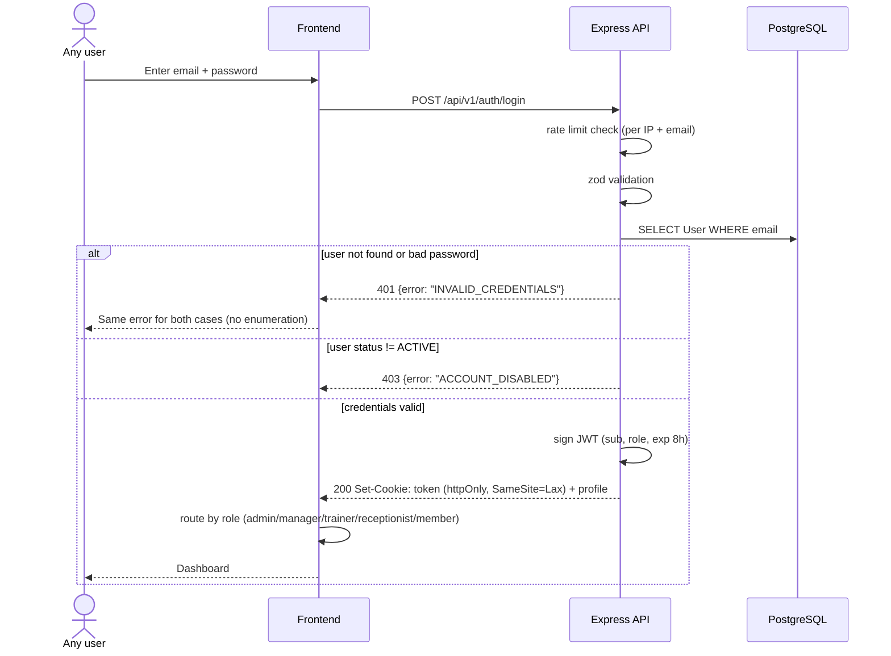

# Sequence — Login

**Notes**: identical error for unknown email vs wrong password (no account enumeration); JWT is never readable by JS (httpOnly) — rule R7. Logout (`POST /api/v1/auth/logout`) clears the cookie.
