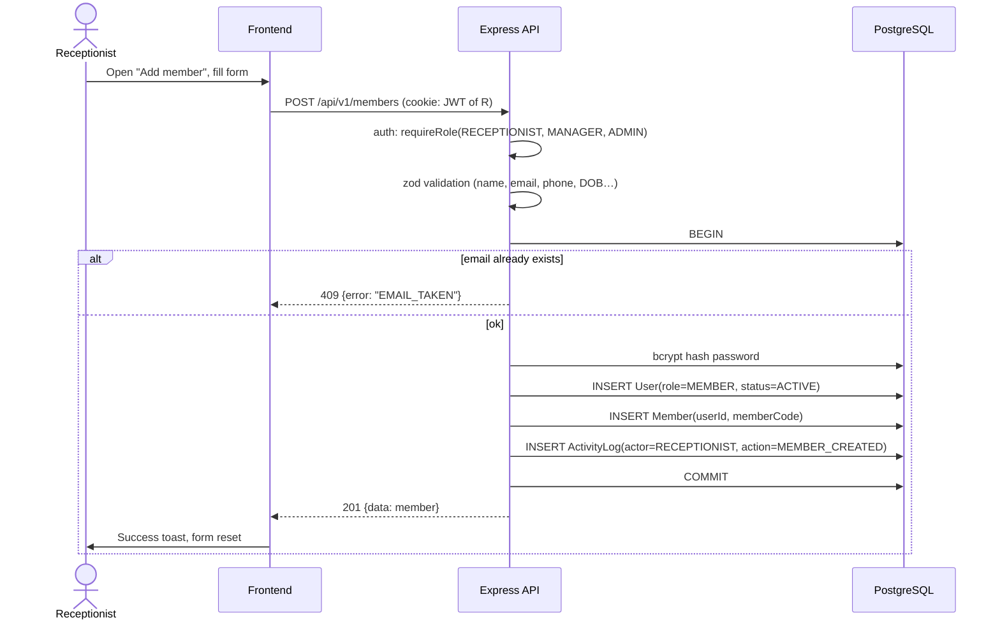

# Sequence — Member Registration

Receptionist (or admin) registers a new member: account creation and member profile are one operation.

**Notes**: single transaction (no `User` without `Member`); email uniqueness enforced by DB constraint; server generates the temporary password if not supplied and returns it once to the receptionist. Corresponds to rule R8 (authorization) and Stage 7 `POST /api/v1/members`.
