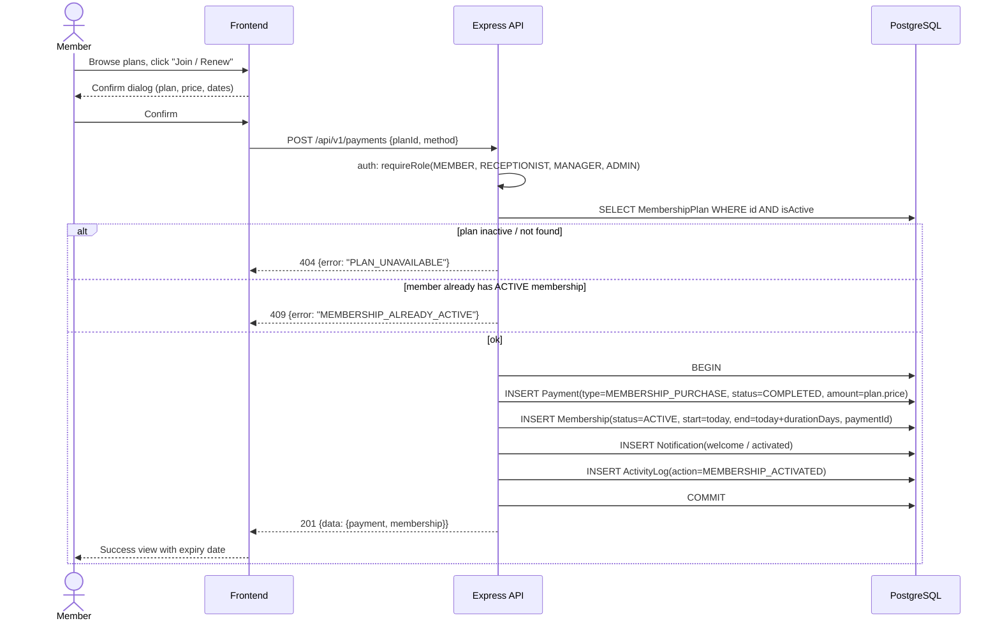

# Sequence — Membership Activation

Member buys a plan; payment completion and membership activation happen atomically (rule R1).

**Notes**: refund path later flips payment to `REFUNDED` and membership to `CANCELLED` (manager/admin only); if any step fails the transaction rolls back — no membership without a completed payment.
