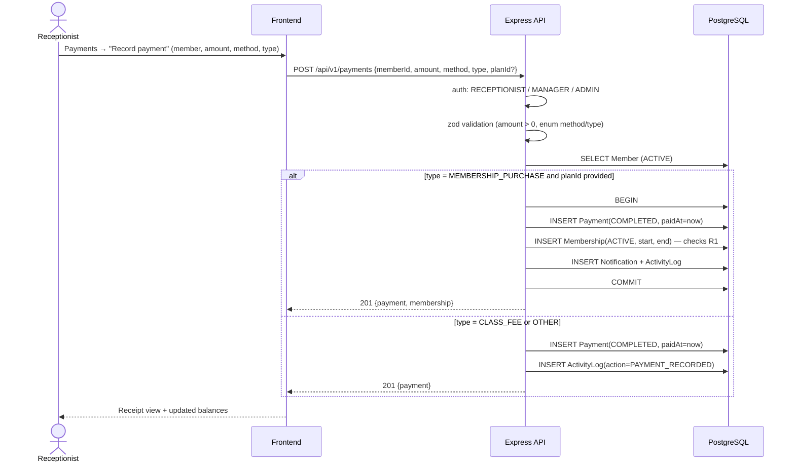

# Sequence — Payment Recording (front desk)

Receptionist records a payment (cash/card/transfer). If it purchases a membership, activation happens in the same transaction; otherwise it is a class fee or other charge.

**Notes**: `amount` is never read from the client-calculated total alone — the server derives membership price from `MembershipPlan.price` (prevents price manipulation, rule R6); failed validation → `422` with field errors; refunds are a manager/admin action flipping status, never editing the row.
