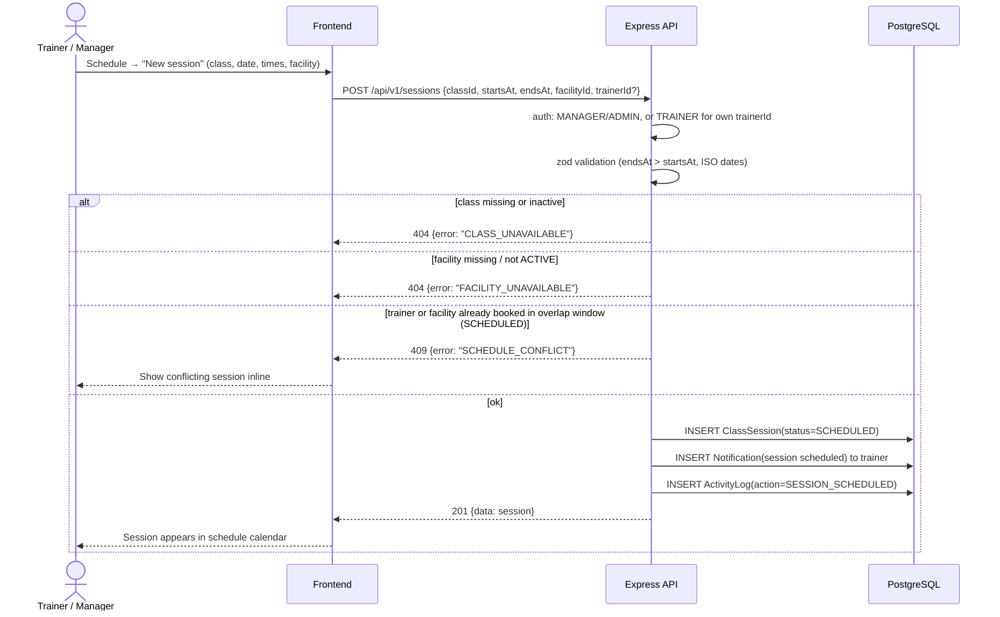

# Sequence — Trainer Scheduling

Trainer (or manager/admin) creates a class session; overlapping trainer/facility assignments are rejected (rule R5).

**Notes**: overlap detection is a range query (`startsAt < :end AND endsAt > :start`) on `SCHEDULED` sessions filtered by trainer and by facility — two separate checks; final guarantee is the Stage 2 index + a DB exclusion-style uniqueness check performed inside the insert transaction.
