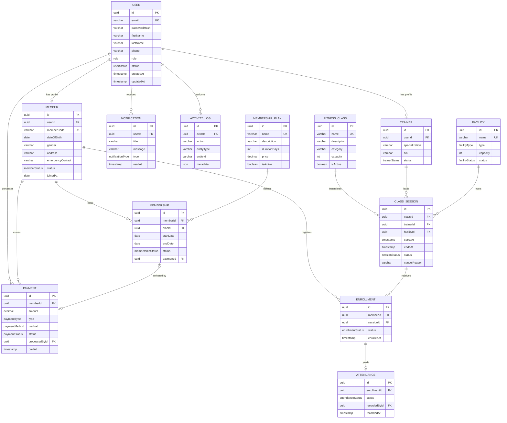

# Stage 2 — Entity Relationship Diagram

Generated from the Stage 1 class diagram; this is the authoritative logical model for the Prisma schema in `backend/prisma/schema.prisma`.

See [README](README.md) for cardinality rules, constraints, and index justification.
