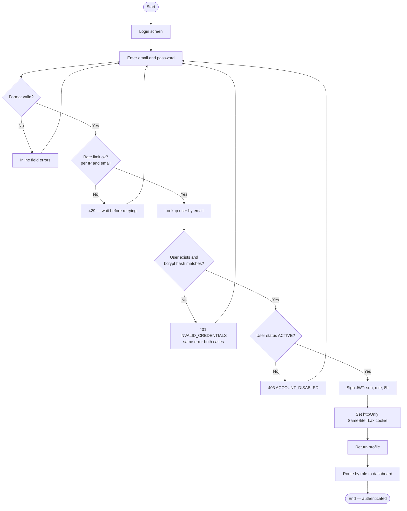

# UC-01 Support — Login Activity

```mermaid
flowchart TD
    A([Start]) --> B[Login screen]
    B --> C[Enter email and password]
    C --> D{Format valid?}
    D -- No --> E[Inline field errors]
    E --> C
    D -- Yes --> F{Rate limit ok?<br/>per IP and email}
    F -- No --> G[429 — wait before retrying]
    G --> C
    F -- Yes --> H[Lookup user by email]
    H --> I{User exists and<br/>bcrypt hash matches?}
    I -- No --> J[401 INVALID_CREDENTIALS<br/>same error both cases]
    J --> C
    I -- Yes --> K{User status ACTIVE?}
    K -- No --> L[403 ACCOUNT_DISABLED]
    L --> C
    K -- Yes --> M[Sign JWT: sub, role, 8h]
    M --> N[Set httpOnly SameSite=Lax cookie]
    N --> O[Return profile]
    O --> P[Route by role to dashboard]
    P --> Q([End — authenticated])
```
