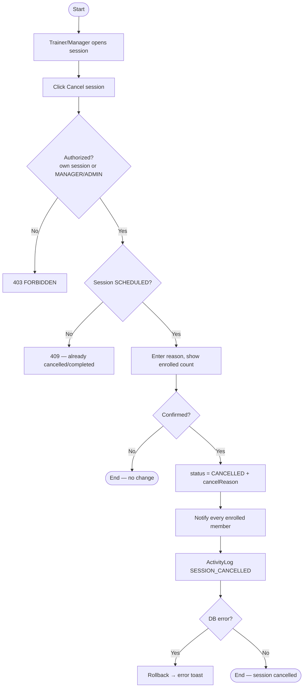

# UC-12 Support — Session Cancellation Activity

```mermaid
flowchart TD
    A([Start]) --> B[Trainer/Manager opens session]
    B --> C[Click Cancel session]
    C --> D{Authorized?<br/>own session or MANAGER/ADMIN}
    D -- No --> E[403 FORBIDDEN]
    D -- Yes --> F{Session SCHEDULED?}
    F -- No --> G[409 — already cancelled/completed]
    F -- Yes --> H[Enter reason, show enrolled count]
    H --> I{Confirmed?}
    I -- No --> J([End — no change])
    I -- Yes --> K[status = CANCELLED + cancelReason]
    K --> L[Notify every enrolled member]
    L --> M[ActivityLog SESSION_CANCELLED]
    M --> N{DB error?}
    N -- Yes --> O[Rollback → error toast]
    N -- No --> P([End — session cancelled])
```

Rules R5/R3: a cancelled session accepts no new enrollments or attendance; enrolled rows remain as history.
